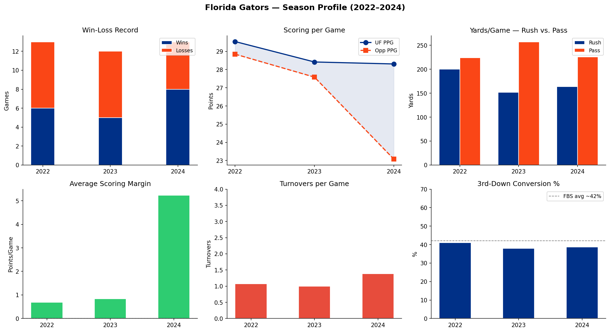
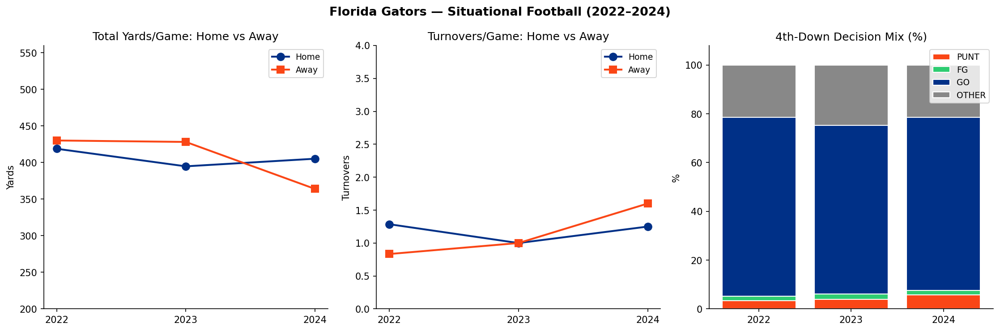
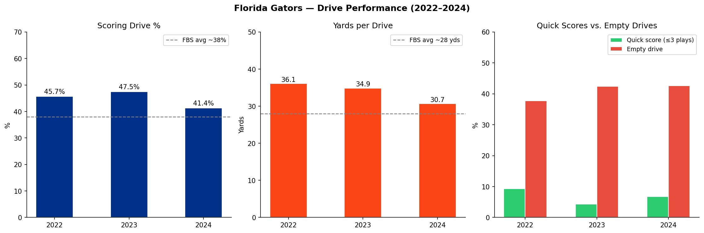
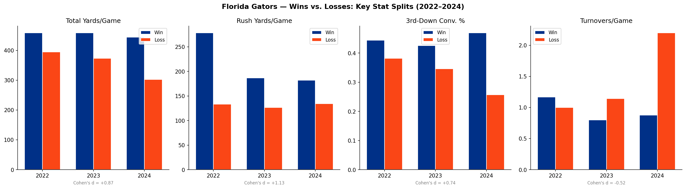
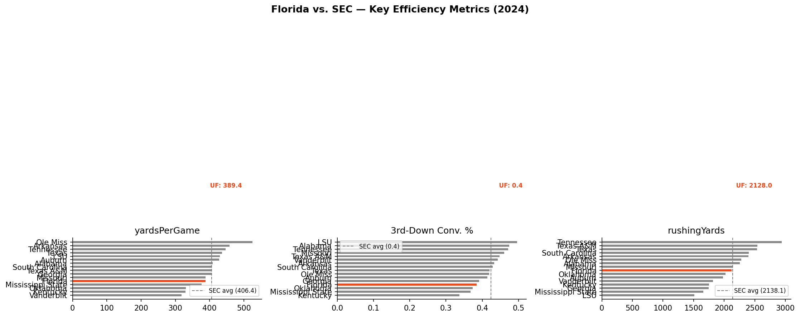

# Florida Gators Football Analytics Dashboard

A reproducible analytics report and interactive dashboard evaluating the UF football program across five performance dimensions (2022–2024).

**Data:** [College Football Data API](https://collegefootballdata.com)  
**Stack:** Python · pandas · matplotlib · Streamlit · pytest

---

## Motivation

The UF Sports Analytics Lab connects applied data science directly to Gators Athletics decision-making. This project mirrors that applied-analytic philosophy: it asks concrete operational questions, answers them with public data, and presents results in a format that coaches and athletic staff can act on — not just a modeling accuracy table.

The emphasis is on **interpretable metrics over predictive complexity**, and on **reproducible code** that other analysts can inherit, extend, and trust.

---

## Research Questions

| Module | Question |
|--------|----------|
| **1. Season Profile** | How has UF's scoring output, yardage profile, and turnover rate evolved? |
| **2. Situational Football** | Does performance differ at home vs. away? How aggressive is UF on 4th down? |
| **3. Drive Performance** | What percentage of drives end in scores vs. empty possessions? |
| **4. Win vs. Loss Scripts** | Which metrics most strongly discriminate wins from losses (Cohen's d)? |
| **5. SEC Context** | How does UF rank among SEC peers on key efficiency metrics? |

---

## Figures

### Figure 1 — Season Profile


### Figure 2 — Situational Football


### Figure 3 — Drive Performance


### Figure 4 — Win vs. Loss Scripts


### Figure 5 — SEC Context (2024)


---

## Quickstart

```bash
# 1. Install dependencies
pip install -r requirements.txt

# 2. Set API key (free at collegefootballdata.com/key)
cp .env.example .env
# edit .env and add your key

# 3. Download raw data  (~2 min)
python src/data_loader.py

# 4. Preprocess
python src/preprocess.py

# 5. Generate all figures
python src/viz.py

# 6. Run dashboard (optional)
streamlit run dashboard/app.py

# 7. Run tests
pytest tests/ -v
```

---

## Project Structure

```
uf-football-analytics-dashboard/
├─ README.md
├─ requirements.txt
├─ .env.example            ← API key template (never commit .env)
├─ LICENSE
│
├─ data/
│  ├─ raw/                 ← downloaded by data_loader.py  [gitignored]
│  └─ processed/           ← cleaned by preprocess.py      [gitignored]
│
├─ notebooks/
│  ├─ 01_data_pull.ipynb
│  ├─ 02_feature_engineering.ipynb
│  └─ 03_exploratory_analysis.ipynb
│
├─ src/
│  ├─ __init__.py
│  ├─ config.py            ← API key + paths + constants
│  ├─ data_loader.py       ← CFBD API calls → data/raw/
│  ├─ preprocess.py        ← cleaning + feature engineering → data/processed/
│  ├─ metrics.py           ← pure analytics functions (no I/O)
│  └─ viz.py               ← figure generation → outputs/figures/
│
├─ dashboard/
│  └─ app.py               ← Streamlit interactive dashboard
│
├─ outputs/
│  ├─ figures/             ← committed PNGs (render in README)
│  └─ tables/              ← committed CSV summaries
│
└─ tests/
   └─ test_metrics.py      ← unit tests for metrics.py (pytest)
```

---

## Methodology

### Data sources
All data is fetched programmatically via the CFBD REST API:
- `/games` — results, scores, home/away flag
- `/games/teams` — per-game stat lines
- `/drives` — drive outcomes and efficiency
- `/plays?down=4` — 4th-down play-by-play
- `/stats/season?conference=SEC` — conference comparison
- `/ratings/sp` — SP+ efficiency ratings

### Key metrics
| Metric | Definition |
|--------|------------|
| Scoring drive % | Drives ending in TD or FG ÷ total drives |
| Empty drive % | Drives ending in punt, turnover, or turnover on downs |
| Quick-score drive | Scoring drive completed in ≤ 3 plays |
| 3rd-down conv. % | Parsed from `n-of-m` CFBD format |
| Cohen's d | Pooled-SD effect size: wins vs. losses on each metric |

### Reproducibility
- `metrics.py` contains **pure functions only** — no file I/O
- All figures are regenerated from scratch with `python src/viz.py`
- Unit tests cover all metric functions with synthetic DataFrames (no API calls needed)

---

## Limitations

- CFBD data does not include proprietary tracking data (PFF grades, Next Gen Stats)
- 3-season window (~39 games) — interpret effect sizes with appropriate caution
- Drive data accuracy depends on CFBD game-state tagging

## Next Steps

- Opponent-adjusted metrics using SP+ ratings
- P4 opponents filter for cleaner conference comparisons
- Expand to 5-season window for more stable effect-size estimates

---

## References

- Connelly, B. (2018). *Study Hall: College Football, Its Stats, and Its Stories.*
- Nestler, S. (2023). Decision Science in Football. INFORMS Annual Meeting, Phoenix, AZ.
- Nestler, S. (2026). Trusted Numbers, Trustworthy Code. INFORMS Annual Meeting.
- Winston, W., Nestler, S., & Pelechrinos, K. (2022). *Mathletics* (2nd ed.). Princeton University Press.
- College Football Data API. https://collegefootballdata.com

---

## Author

**Haeyong Chun**  
Ph.D. Candidate, Kinesiology — Michigan State University  
Sports Analytics Graduate Certificate, MSU (2025–present)  
[github.com/haeyong520](https://github.com/haeyong520)
